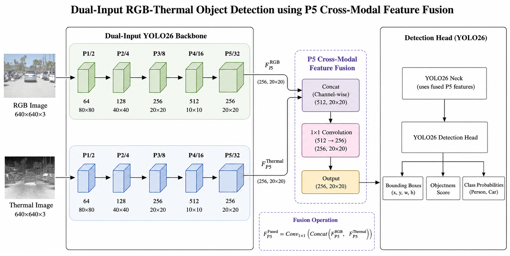
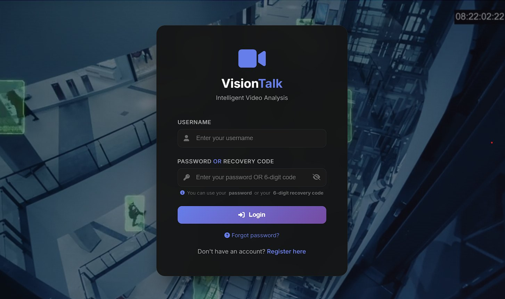
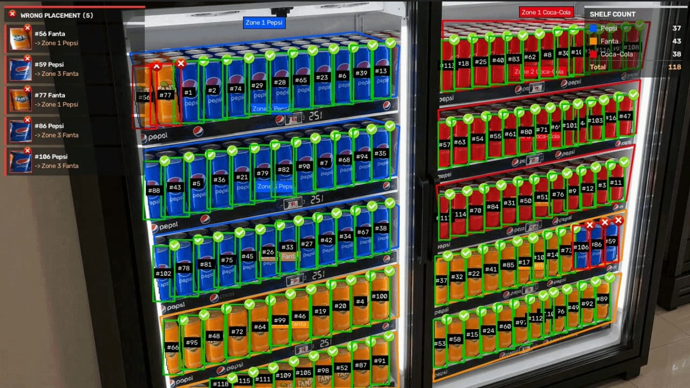
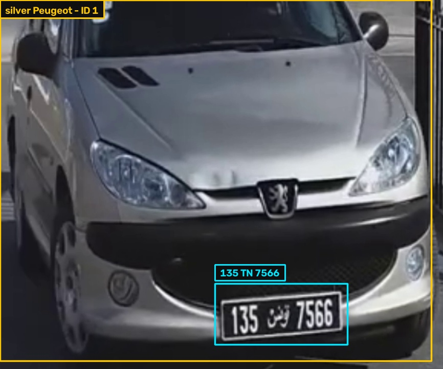
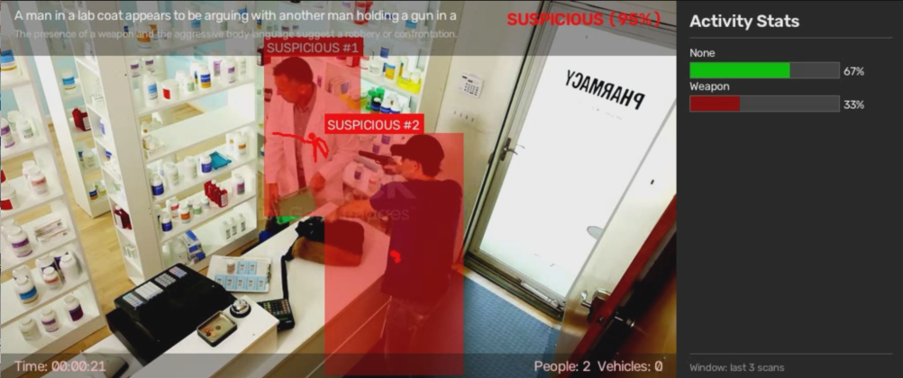
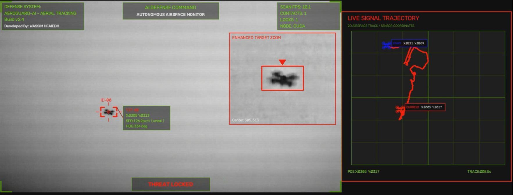

# <strong>Hi, I'm Wassim Hfaiedh</strong> 👋

  
  

---

## <strong>About Me</strong>

<strong>AI Engineer</strong> from Tunisia building practical systems in <strong>Computer Vision</strong>, <strong>multimodal AI</strong>, and <strong>video understanding</strong>. I work on <strong>object detection</strong>, <strong>tracking</strong>, <strong>VLM/RAG</strong> applications, and <strong>efficient model deployment</strong>.

---

## <strong>Tech Stack</strong>

  
    
  <code><strong>YOLO</strong></code> · <code><strong>Transformers</strong></code> · <code><strong>CLIP</strong></code> · <code><strong>VLMs</strong></code> · <code><strong>RAG</strong></code> · <code><strong>ChromaDB</strong></code> · <code><strong>Qdrant</strong></code> · <code><strong>ONNX</strong></code> · <code><strong>CUDA</strong></code>

---

## <strong>Featured AI Projects</strong>

<table>
  <tr>
    <td width="50%" valign="top">
      <h3 align="center">
        <strong><a href="https://github.com/Wassimhfaiedh/RGBTYOLO--Dual-Input-YOLO26-for-RGB-Thermal-Object-Detection">RGB-Thermal Multispectral YOLO</a></strong>
      </h3>
      

        
      

      
<strong>Dual-input object detection</strong> system that fuses <strong>RGB</strong> and <strong>thermal</strong> features for robust <strong>person</strong> and <strong>vehicle detection</strong> in challenging visibility conditions.

      
<code><strong>RGB-Thermal Fusion</strong></code> <code><strong>YOLO26</strong></code> <code><strong>PyTorch</strong></code>

    </td>
    <td width="50%" valign="top">
      <h3 align="center">
        <strong><a href="https://github.com/Wassimhfaiedh/VisionTalk-Multimodal-RAG-Video-Understanding">Vision Talk</a></strong>
      </h3>
      

        
      

      
<strong>Multimodal Video RAG</strong> platform that transforms <strong>video</strong> into searchable memory with <strong>semantic retrieval</strong>, <strong>timestamped results</strong>, and <strong>natural-language question answering</strong>.

      
<code><strong>VLM</strong></code> <code><strong>Video RAG</strong></code> <code><strong>Semantic Search</strong></code>

    </td>
  </tr>
  <tr>
    <td width="50%" valign="top">
      <h3 align="center">
        <strong><a href="https://github.com/Wassimhfaiedh/RetailShelfMonitor">Retail Shelf Monitor</a></strong>
      </h3>
      

        
      

      
<strong>Computer vision system</strong> that detects <strong>products</strong> on retail shelves and supports <strong>visual shelf occupancy</strong> and <strong>inventory monitoring</strong>.

      
<code><strong>Retail AI</strong></code> <code><strong>Product Detection</strong></code> <code><strong>YOLO</strong></code>

    </td>
    <td width="50%" valign="top">
      <h3 align="center">
        <strong><a href="https://github.com/Wassimhfaiedh/TunisianVehicleSearch">Tunisian Vehicle Search</a></strong>
      </h3>
      

        
      

      
<strong>AI-powered vehicle search</strong> platform that detects <strong>vehicles</strong>, reads <strong>Tunisian license plates</strong>, and retrieves matches using <strong>text</strong>, <strong>image</strong>, or <strong>plate queries</strong>.

      
<code><strong>YOLO</strong></code> <code><strong>CLIP</strong></code> <code><strong>Plate Recognition</strong></code>

    </td>
  </tr>
  <tr>
    <td width="50%" valign="top">
      <h3 align="center">
        <strong><a href="https://github.com/Wassimhfaiedh/VisionGuard">VisionGuard</a></strong>
      </h3>
      

        
      

      
<strong>Intelligent surveillance system</strong> that detects and tracks <strong>security events</strong>, generates <strong>visual descriptions</strong>, and produces <strong>real-time alerts</strong> and <strong>event logs</strong>.

      
<code><strong>Smart Surveillance</strong></code> <code><strong>Object Tracking</strong></code> <code><strong>VLM</strong></code>

    </td>
    <td width="50%" valign="top">
      <h3 align="center">
        <strong><a href="https://github.com/Wassimhfaiedh/AeroGuard-AI">AeroGuard AI</a></strong>
      </h3>
      

        
      

      
<strong>Real-time drone detection</strong> and <strong>tracking system</strong> with <strong>trajectory visualization</strong>, <strong>target zoom</strong>, <strong>detection logging</strong>, and an <strong>aerial monitoring HUD</strong>.

      
<code><strong>Drone Detection</strong></code> <code><strong>YOLO</strong></code> <code><strong>McByteTracker</strong></code>

    </td>
  </tr>
</table>

---

## <strong>GitHub Activity</strong>

---

  <strong>Building intelligent systems that connect vision and language.</strong>

